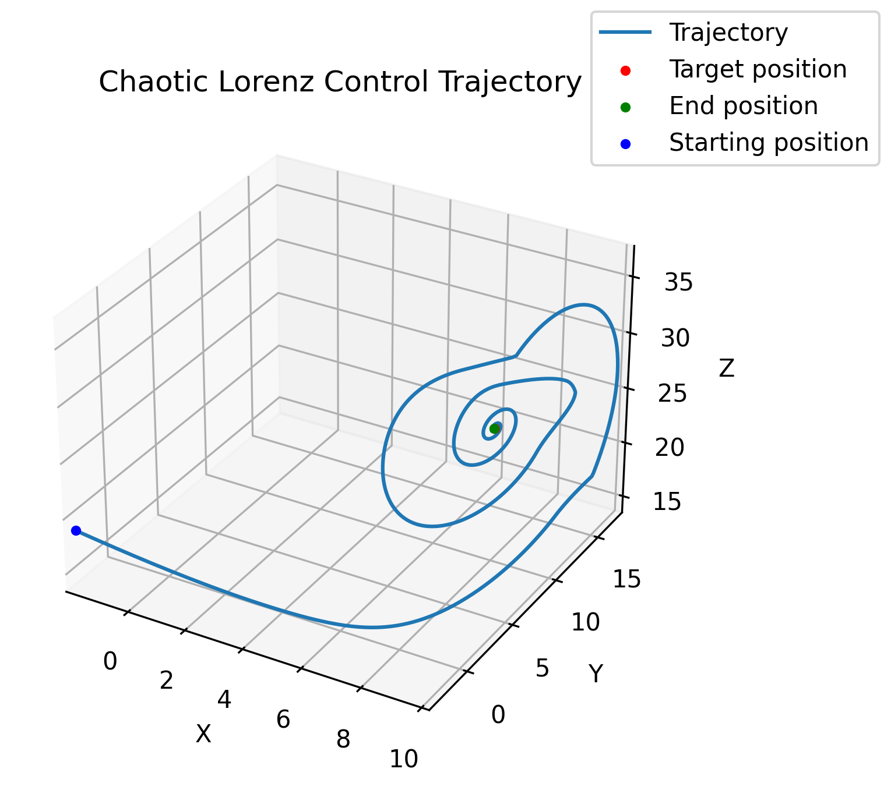
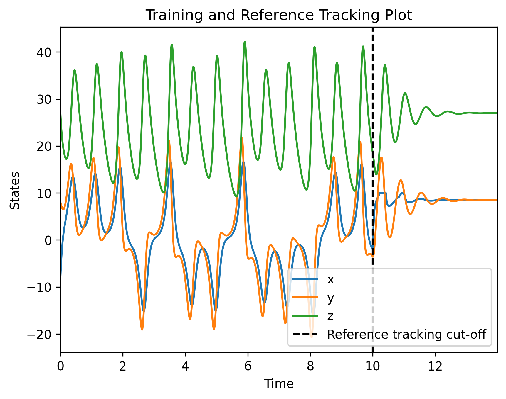
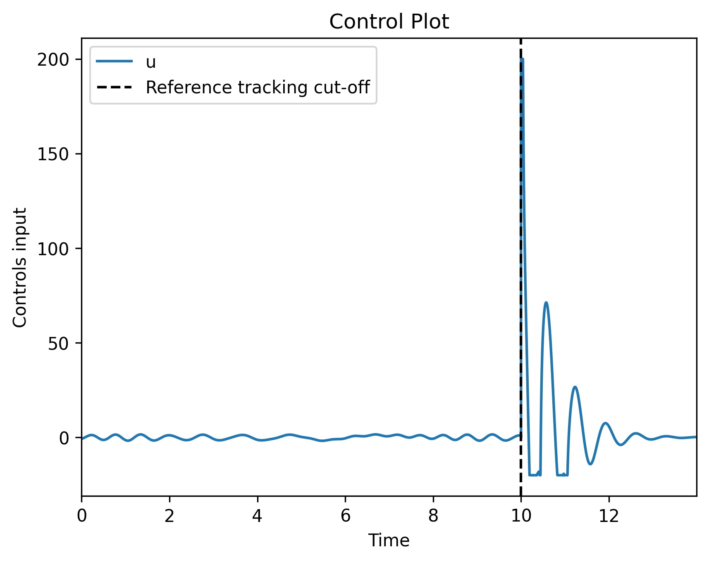
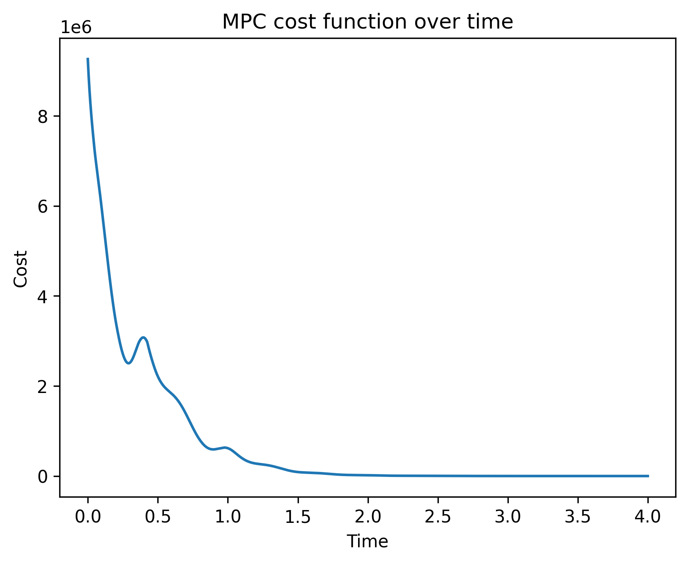

# Background

Model Predictive Control has been a long-standing subject of research and has found practical application across various domains. Nevertheless, a prevalent issue with these control strategies that rely on models is their significant reliance on accurately modeling dynamic systems, usually based on pre-established dynamics. The introduction of the SINDy algorithm in 2016[1] marked a significant shift. This algorithm enables the identification of profoundly nonlinear dynamics through the SINDy framework, eliminating the need for extensive datasets. This is particularly advantageous in real-life situations where low-data limit is prominent[2], owing to the framework's strong generalisation capabilities[3] and low computational costs. The equation below shows the model learned with SINDy algorithm, consisting a model coefficient term and feature library term.

$$
    \dot{X}=Θ(X)Ξ
$$

Extensively developed in the 1980s, model predictive control employs online learning to forecast the subsequent N steps of states (referred to as the horizon) using $\dot{X}$. Within this horizon, a cost function is assigned. This function incorporates a weighted calculation of the disparity between the current state and the desired state (measured as ||current - target state||) along with the amount of control effort. By striking a balance between these factors, an optimal sequence of controls can be determined at each step. This approach has demonstrated remarkable efficacy, particularly when addressing constraints and obstacles within the optimisation problem. In this illustration, both the control and the prediction interval are aligned for simplicity, and a linear quadratic cost function is employed.

In this notebook, the CASADI python library, a symbolic framework for numerical optimisation is used due to its flexibility and customisation, active open-source community, and the popularity among academics.

# System Identification

The choice of the chaotic Lorenz control system as our sample problem is deliberate for several reasons. This system serves as a benchmark for studying chaotic systems, offering a clear contrast to complex scenarios like the double-pendulum with intricate dynamics. Widely recognized and deeply understood, the Lorenz system represents a prominent instance of a nonlinear dynamic system showcasing chaotic traits. Despite its chaotic nature, these equations possess an analytical solution, facilitating a basis for accurate comparisons. The objective of this notebook is to achieve stabilisation of the state towards the two unstable equilibriums at coordinates (±√72,±√72,27).

$$
\begin{aligned}
& \dot{x}=\sigma\left(y-x\right)+u \\
& \dot{y}=x\left(\rho-z\right)-y \\
& \dot{z}=xy-\beta z
\end{aligned}
$$

To gather the data essential for system identification, we employ a Schroeder sweep to stimulate the system. The key strength of the Schroeder sweep lies in its capacity to span a wide array of frequencies in a relatively concise time span. When we implement the Schroeder sweep, we effectively provoke the system across a diverse range of frequencies simultaneously. This interplay between the sweep's dynamic frequency changes and the system's nonlinear characteristics unveils intricate behaviors that could remain concealed when employing basic sinusoidal inputs. In low data limit, the user can deploy an active learning strategy to further reduce the amount of data required.[2,4],

The subsequent steps in the SINDy learning process closely resemble those found in other instances within the PySindy repository, accessible at https://github.com/dynamicslab/pysindy/tree/master/examples. Readers are encouraged to explore these illustrative notebooks for additional insights and explanations.

# Results and Visualisation

  
  

  
  

